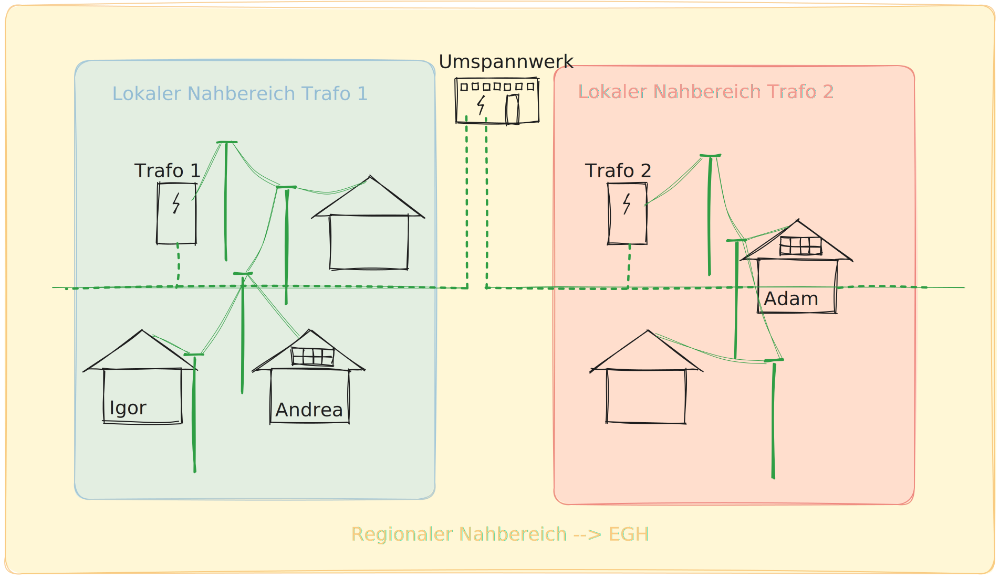

# Erneuerbare Energiegemeinschaft

Mit 01.01.2022 ist das Erneuerbaren-Ausbau-Gesetz (EAG) in Österreich in Kraft getreten, das auch die Gründung einer Erneuerbare-Energie-Gemeinschaften regelt.

## Lokal versus Regional

Eine erneuerbare Energiegemeinschaft (EEG) kann sich auf lokaler oder regionaler Ebene organisieren. Der Hauptunterschied zwischen beiden Formen liegt in der Netzebene und der Verbindung zwischen den Teilnehmern. In diese Übersicht beschränken wir uns ausschließlich auf Netzebene 7: Lokales Niederspannungsnetz (0,4 kV bis 1 kV).

## Lokale Energiegemeinschaft

- Die Teilnehmer sind über einen gemeinsamen Transformatorstation (Trafo) verbunden.
- Die Erzeugungsanlage und die Teilnehmer sind über das Niederspannungs-Ortsnetz dieser Trafostation verbunden.
- Keine fremden oder höheren Netzebenen sind involviert.

> [!TIP|style:flat|label:Vorteile]
> :fa-solid fa-check: Höhere Netzkostenersparnisse (bis 57%)
> :fa-solid fa-check: Einfachere Organisation und Verwaltung
> :fa-solid fa-check: Lokale Autarkie und regionale Wertschöpfung

## Regionale Energiegemeinschaft

- Die Teilnehmer sind über dasselbe Umspannwerk miteinander verbunden.
- Es werden regionale Mittelspannungsleitungen benötigt, um die Erzeugungsanlage und die Teilnehmer miteinander zu verbinden.
- Die Energiegemeinschaft übersteigt den Bereich einer Trafostation und umfasst mehrere Netzebenen.

> [!TIP|style:flat|label:Vorteile]
> :fa-solid fa-check: Größere Skalierbarkeit und mögliche bessere Wirtschaftlichkeit
> :fa-solid fa-check: Möglichkeit, mehrere Trafostationen und Netzebenen zu umfassen
> :fa-solid fa-check: jedoch geringere Netzkostenersparnisse (28%) und höhere Servicekosten

Es ist wichtig zu beachten, dass die Definitionen und Voraussetzungen für lokale und regionale EEG variieren. In Österreich gibt es zwei Modelle: die Bürgerenergiegemeinschaft (BEG) und die erneuerbare Energiegemeinschaft (EEG). BEGs dürfen Strom aus jeglichen Energiequellen erzeugen, während EEGs auf erneuerbare Energiequellen beschränkt sind. **BEGs werden in diese Übersicht außer Betracht gelassen, wir schauen hier nur auf die Voraussetzungen der EEGs.**

## Anmelden einer EEG

Es gibt in Österreich unterschiedliche Gesellschaftsformen und Rechtskörper, die gegründet werden können, um eine Energiegemeinschaft rechtsgültig betreiben zu können. Mögliche Rechtskörper für die Gründung einer Energiegemeinschaft sind ein Verein, eine Genossenschaft, eine Kapitalgesellschaft oder eine ähnliche Vereinigung mit Rechtspersönlichkeit. Mit der Gründung der Gesellschaftsform wird die Gemeinschaft handlungsfähig. Für die Registrierung der Energiegemeinschaften beim Netzbetreiber ist die Gründung einer Rechtsperson Voraussetzung, weil die spezifische Gemeinschafts-ID des Rechtskörpers verlangt wird und über diesen mit dem Netzbetreiber kommuniziert wird. 

Für die Anmeldung bei den Wiener Netzen muss eine aktive Erzeugungsanlage vorhanden sein. Die Erzeugungsanlage muss technisch fertig gestellt und eine Anmeldung vom Energielieferanten bei den Wiener Netzen eingelangt sein.

Die gemeinschaftliche Erzeugungsanlage bzw. die Energiegemeinschaft muss bei ebUtilities als Marktteilnehmer*in am Elektrizitätsmarkt registriert werden. Mit der Registrierung erhalten Sie Ihre Marktpartner-ID. Diese ID wird benötigt für die Anmeldung bei den Wiener Netzen.

Als nächstes muss die gemeinschaftliche Erzeugungsanlage oder die Energiegemeinschaft bei den Wiener Netzen angemeldet werden. Für den Abschluss des Vertrags werden folgende Informationen gebraucht:

- Name der Gemeinschaft
- Marktpartner-ID (GC-Nummer: gemeinschaftliche Erzeugungsanlage, oder RC-Nummer: Erneuerbare-Energie-Gemeinschaft, oder CC-Nummer: Bürgerenergiegemeinschaft)
- Name der Ansprechperson bei der gemeinschaftlichen Erzeugungsanlage bzw. Energiegemeinschaft
- Kontaktdaten: E-Mail-Adresse, Telefonnummer
- Einspeisezählpunktnummer(n) der Erzeugungsanlage(n)
- Bei Energiegemeinschaften: Firmenbuchnummer oder Vereinsnummer

## Rechtsunsicherheiten

Gemäß dem EAG darf der Hauptzweck einer EEG „nicht im finanziellen Gewinn liegen“ (§ 79 EAG), zumal die Kerntätigkeit einer EEG die Nutzung der gemeinschaftlich erzeugten Energie durch die Gemeinschaftsmitglieder ist. Diese Gemeinnützigkeit muss in den Statuten verankert sein oder sich aus der Organisationsform der EEG ergeben.

Neben dieser Kerntätigkeit ist eine EEG auch berechtigt, (Überschuss-)Energie gewinnbringend an ein Energieversorgungsunternehmen zu veräußern. Diese Nebentätigkeit einer EEG darf sohin in Gewinnerzielungsabsicht erfolgen, aber nicht zum Selbstzweck werden. Überschüsse sind an die Mitglieder weiterzureichen. Das EAG normiert ausdrücklich, dass die Bestimmungen der Gewerbeordnung nicht anwendbar sind. Eine Gewerbeanmeldung für die gewinnbringende Veräußerung von Energie ist somit nicht erforderlich. Auch wenn die gewinnbringende Veräußerung von Energie nicht in den Anwendungsbereich der Gewerbeordnung fällt, ist in der Praxis darauf zu achten, dass der Verkauf von Energie lediglich als Nebentätigkeit der EEG ausgeübt und die Kerntätigkeit der Energienutzung gewahrt wird.

## Die Registrierung am Elektrizitätsmarkt
Als außenwirksamer Akt ist — neben der gesellschaftsrechtlichen Gründung — lediglich die Registrierung der Energiegemeinschaft als Marktteilnehmer am Elektrizitätsmarkt vorgesehen, nicht jedoch eine behördliche Prüfung der Erfüllung der gesetzlichen Voraussetzungen wie beispielsweise ein eingeschränktes Tätigkeitsfeld, die Kompatibilität der Mitglieder sowie die Freiwilligkeit der Teilnahme an einer EEG — ähnlich einer Gewerbeanmeldung.

Die E-Control als Regulierungsbehörde kann lediglich stichprobenartig oder anlassfallbezogen die Einhaltung der gesetzlichen Voraussetzungen und damit die Anerkennung als EEG überprüfen. Bei Nichteinhaltung der gesetzlichen Vorgaben kann sie die Herstellung des rechtmäßigen Zustandes mit Bescheid auftragen. Diese nachprüfende Kontrolle ist weder mit einem Anmeldeverfahren noch mit einer Unbedenklichkeitsbescheinigung im Sinne einer Bestätigung der Erfüllung der gesetzlichen Voraussetzungen als EEG vergleichbar. Wird der Aufforderung der E-Control zur Herstellung des rechtmäßigen Zustandes nicht (zur Gänze) entsprochen, drohen Verwaltungsstrafen von bis zu 75.000 Euro. Damit geht eine Rechtsunsicherheit in Bezug auf die Erfüllung der gesetzlichen Voraussetzungen bei der Gründung einer EEG einher, weshalb ein entsprechender Compliance-Check im Gründungsstadium auf jeden Fall zu empfehlen ist.

## Sammelanfrage beim Netzbetreiber um herauszufinden, in welchem Lokal- oder Regionalbereich potentielle Interessentinnen/Interessenten angesiedelt sind?

Unabhängig davon ob eine EEG auftritt als Lokale Energiegemeinschaft oder als Regionale Energiegemeinschaft, kommen alle dem Netzinfrastruktur bedingten Anschlüße in betracht zum teilnehmen an der EEG.

Mit einer Vollmachts-Vorlage ist es möglich, dass ein/eine Verantwortlicher/Verantwortliche einer zukünftigen oder bestehenden Energiegemeinschaft den Lokal- oder Regionalbereich eines/einer potentiellen Interessenten/Interessentin beim Netzbetreiber erfragt. (https://energiegemeinschaften.gv.at/faqs/)