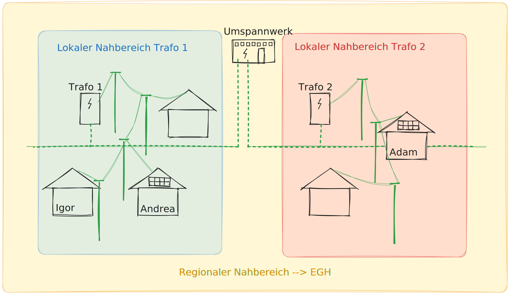

# Erneuerbare Energiegemeinschaft

##Lokal versus Regional

Eine erneuerbare Energiegemeinschaft (EEG) kann sich auf lokaler oder regionaler Ebene organisieren. Der Hauptunterschied zwischen beiden Formen liegt in der Netzebene und der Verbindung zwischen den Teilnehmern. In dieser Übersicht beschränken wir uns ausschließlich auf Netzebene 7: Lokales Niederspannungsnetz (0,4 kV bis 1 kV).

## Lokale Energiegemeinschaft

- Die Teilnehmer sind über einen gemeinsamen Transformatorstation (Trafo) verbunden.
- Die Erzeugungsanlage und die Teilnehmer sind über das Niederspannungs-Ortsnetz dieser Trafostation verbunden.
- Keine fremden oder höheren Netzebenen sind involviert.

> [!TIP|style:flat|label:Vorteile]
> :fa-solid fa-check: Höhere Netzkostenersparnisse (bis 57%)
> :fa-solid fa-check: Einfachere Organisation und Verwaltung
> :fa-solid fa-check: Lokale Autarkie und regionale Wertschöpfung

## Regionale Energiegemeinschaft

- Die Teilnehmer sind über dasselbe Umspannwerk miteinander verbunden.
- Es werden regionale Mittelspannungsleitungen benötigt, um die Erzeugungsanlage und die Teilnehmer miteinander zu verbinden.
- Die Energiegemeinschaft übersteigt den Bereich einer Trafostation und umfasst mehrere Netzebenen.

> [!TIP|style:flat|label:Vorteile]
> :fa-solid fa-check: Größere Skalierbarkeit und mögliche bessere Wirtschaftlichkeit
> :fa-solid fa-check: Möglichkeit, mehrere Trafostationen und Netzebenen zu umfassen
> :fa-solid fa-check: jedoch geringere Netzkostenersparnisse (28%) und höhere Servicekosten

Es ist wichtig zu beachten, dass die Definitionen und Voraussetzungen für lokale und regionale EEG variieren können. In Österreich gibt es zwei Modelle: die Bürgerenergiegemeinschaft (BEG) und die erneuerbare Energiegemeinschaft (EEG). BEGs dürfen Strom aus jeglichen Energiequellen erzeugen, während EEGs auf erneuerbare Energiequellen beschränkt sind. BEGs werden hier außer Betracht gelassen, wir schauen in dieser Übersicht nur auf die Voraussetzungen der EEGs.

## Anmelden einer EEG

Es gibt in Österreich unterschiedliche Gesellschaftsformen und Rechtskörper, die gegründet werden können, um eine Energiegemeinschaft rechtsgültig betreiben zu können. Mögliche Rechtskörper für die Gründung einer Energiegemeinschaft sind ein Verein, eine Genossenschaft, eine Kapitalgesellschaft oder eine ähnliche Vereinigung mit Rechtspersönlichkeit. Mit der Gründung der Gesellschaftsform wird die Gemeinschaft handlungsfähig. Für die Registrierung der Energiegemeinschaften beim Netzbetreiber ist die Gründung einer Rechtsperson Voraussetzung, weil die spezifische Gemeinschafts-ID des Rechtskörpers verlangt wird und über diesen mit dem Netzbetreiber kommuniziert wird. 

Für die Anmeldung bei den Wiener Netzen muss eine aktive Erzeugungsanlage vorhanden sein. Die Erzeugungsanlage muss technisch fertig gestellt und eine Anmeldung vom Energielieferanten bei den Wiener Netzen eingelangt sein.

Die gemeinschaftliche Erzeugungsanlage bzw. die Energiegemeinschaft muss bei ebUtilities als Marktteilnehmer*in am Elektrizitätsmarkt registriert werden. Mit der Registrierung erhalten Sie Ihre Marktpartner-ID. Diese ID benötigen Sie für die Anmeldung bei den Wiener Netzen.

Als nächstes muss die gemeinschaftliche Erzeugungsanlage oder die Energiegemeinschaft bei den Wiener Netzen angemeldet werden. Für den Abschluss des Vertrags werden folgende Informationen gebraucht:

- Name der Gemeinschaft
- Marktpartner-ID (GC-Nummer: gemeinschaftliche Erzeugungsanlage, oder RC-Nummer: Erneuerbare-Energie-Gemeinschaft, oder CC-Nummer: Bürgerenergiegemeinschaft)
- Name der Ansprechperson bei der gemeinschaftlichen Erzeugungsanlage bzw. Energiegemeinschaft
- Kontaktdaten: E-Mail-Adresse, Telefonnummer
- Einspeisezählpunktnummer(n) der Erzeugungsanlage(n)
- Bei Energiegemeinschaften: Firmenbuchnummer oder Vereinsnummer
